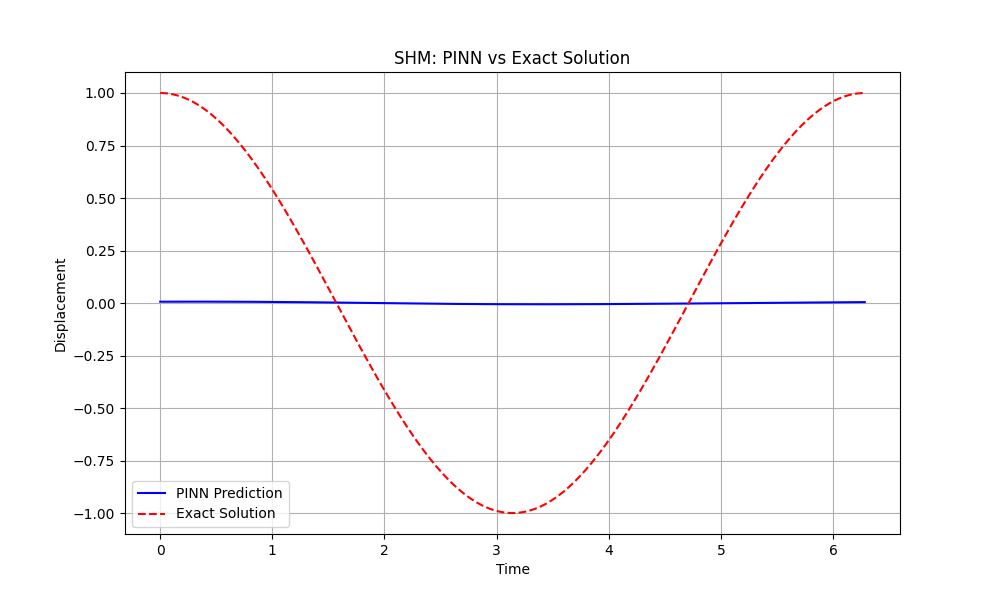
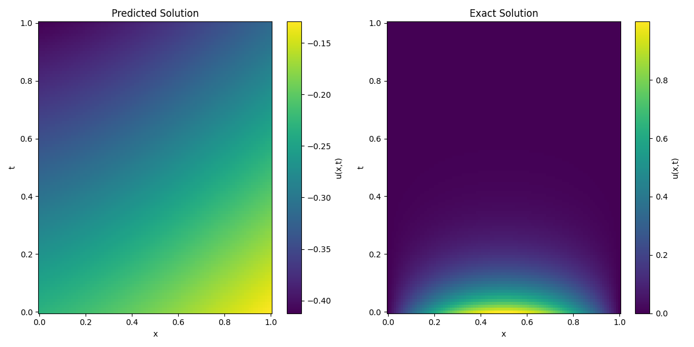
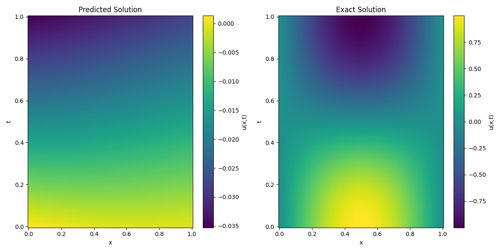
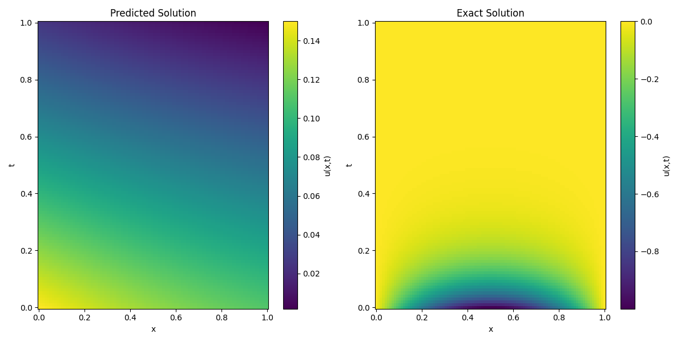
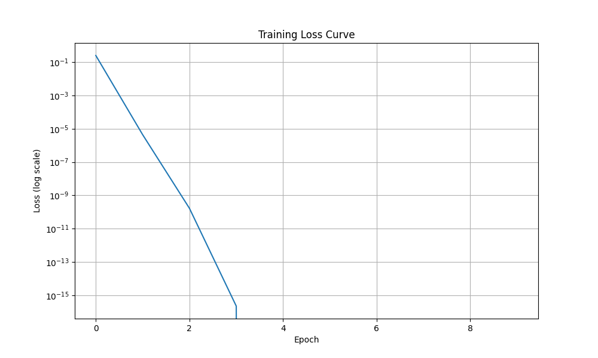
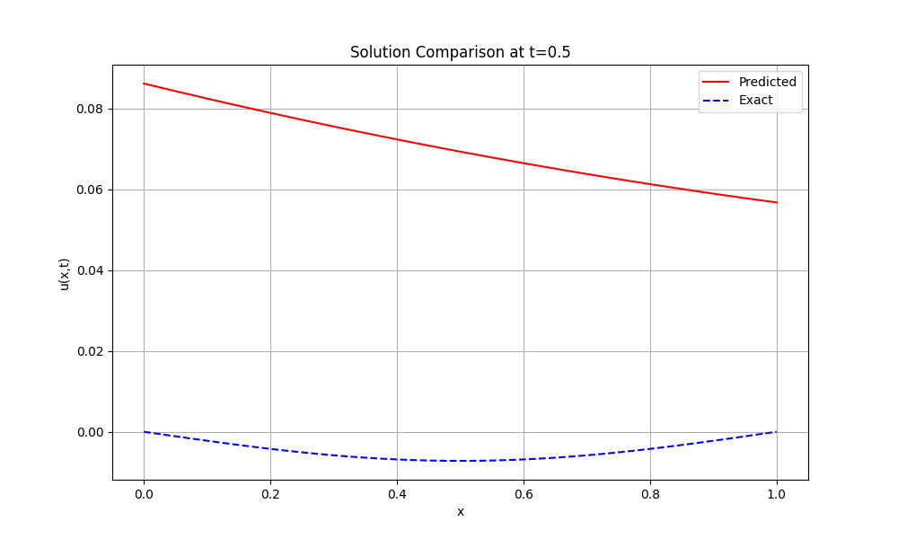
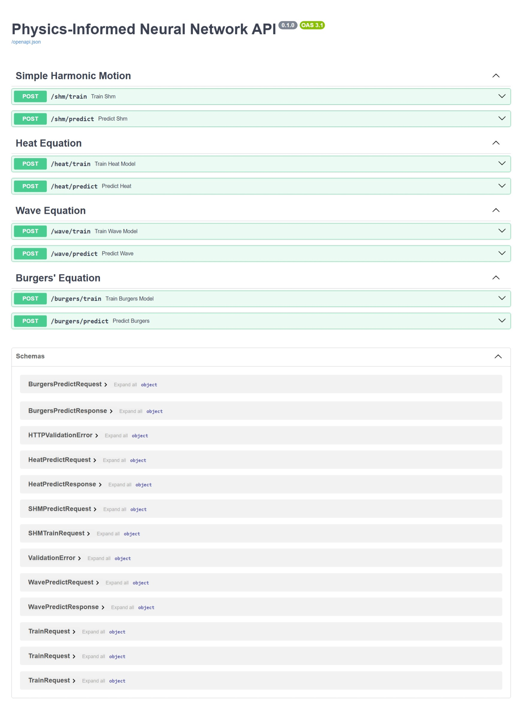

# About
A Physics-Informed Neural Network (PINN) framework for solving partial differential equations (PDEs) with FastAPI integration. This project implements PINNs for various physical systems including simple harmonic motion, heat transfer, wave propagation, and fluid dynamics (Burgers' equation). The framework provides a modular architecture for training neural networks that respect physical laws, with RESTful APIs for model training and prediction.

# Physics-Informed Neural Network (PINN) Project

This project implements a modular framework for solving partial differential equations (PDEs) using Physics-Informed Neural Networks (PINNs). It supports multiple equations (e.g., simple harmonic motion, heat, wave, Burgers' equations) and includes a FastAPI server for exposing PINN functionality via RESTful APIs. The framework is designed for extensibility, with separate modules for models, equations, data generation, training, evaluation, and hyperparameter tuning.

## Project Structure

The project follows a modular architecture with the following structure:

```
physics_informed_neural_network/
├── app/                    # FastAPI application
│   ├── __init__.py
│   ├── api/               # API endpoints
│   │   ├── __init__.py
│   │   ├── endpoints/     # Equation-specific endpoints
│   │   │   ├── __init__.py
│   │   │   ├── shm.py
│   │   │   ├── heat.py
│   │   │   ├── wave.py
│   │   │   └── burgers.py
│   │   └── router.py
│   ├── core/              # Core application logic
│   │   ├── __init__.py
│   │   ├── config.py
│   │   └── dependencies.py
│   └── schemas/           # API request/response schemas
│       ├── __init__.py
│       ├── shm.py
│       ├── heat.py
│       ├── wave.py
│       └── burgers.py
├── src/                   # Source code
│   ├── models/           # Neural network models
│   │   ├── base_pinn.py
│   │   ├── shm_pinn.py
│   │   ├── heat_pinn.py
│   │   ├── wave_pinn.py
│   │   └── burgers_pinn.py
│   ├── equations/        # PDE implementations
│   │   ├── base_equation.py
│   │   ├── shm_equation.py
│   │   ├── heat_equation.py
│   │   ├── wave_equation.py
│   │   └── burgers_equation.py
│   ├── data/            # Data generation
│   │   ├── generators/  # Data generators
│   │   │   ├── data_generator.py
│   │   │   ├── shm_data.py
│   │   │   ├── heat_data.py
│   │   │   ├── wave_data.py
│   │   │   └── burgers_data.py
│   │   ├── initial_conditions/  # Initial conditions
│   │   │   ├── ic_shm.py
│   │   │   ├── ic_heat.py
│   │   │   ├── ic_wave.py
│   │   │   └── ic_burgers.py
│   │   └── boundary_conditions/  # Boundary conditions
│   │       ├── bc_heat.py
│   │       ├── bc_wave.py
│   │       └── bc_burgers.py
│   ├── training/        # Training implementations
│   │   ├── trainer.py
│   │   ├── shm_trainer.py
│   │   ├── heat_trainer.py
│   │   ├── wave_trainer.py
│   │   └── burgers_trainer.py
│   └── utils/          # Utility functions
│       ├── __init__.py
│       └── config_parser.py
├── results/            # Training results
│   ├── shm/           # SHM results
│   │   ├── models/    # Trained models
│   │   │   └── model.pth
│   │   ├── plots/     # Generated plots
│   │   │   ├── loss_curve.png
│   │   │   ├── solution_comparison.png
│   │   │   └── solution_slice.png
│   │   └── metrics/   # Training metrics
│   │       └── loss_history.npy
│   ├── heat/          # Heat equation results
│   ├── wave/          # Wave equation results
│   └── burgers/       # Burgers' equation results
├── configs/           # Configuration files
│   └── equations/     # Equation configurations
│       ├── shm_equation.yaml
│       ├── heat_equation.yaml
│       ├── wave_equation.yaml
│       └── burgers_equation.yaml
├── scripts/          # Utility scripts
│   ├── hyperparameter_tuning/  # Hyperparameter optimization
│   │   ├── tune_shm.py
│   │   ├── tune_heat.py
│   │   ├── tune_wave.py
│   │   └── tune_burgers.py
│   └── analyze_results.py
├── tests/           # Test suite
│   ├── __init__.py
│   ├── test_models.py
│   ├── test_equations.py
│   ├── test_data.py
│   └── test_training.py
├── requirements.txt  # Python dependencies
├── setup_project.sh  # Project setup script
├── activate_ml_env.sh  # Environment activation (Linux/Mac)
├── activate_ml_env.ps1  # Environment activation (Windows)
└── README.md        # Project documentation
```

## Data Organization

Each equation has its own data directory structure:

```
data/{equation}/
├── x.pt                    # Spatial coordinates
├── t.pt                    # Temporal coordinates
└── training_data.pt        # Complete training data
```

Results are stored in:

```
results/{equation}/
├── models/                 # Trained model weights
├── plots/                  # Generated plots
└── metrics/                # Training metrics
```

## Framework Overview

The framework consists of several key components:
1. **Models**: Neural network architectures for different equations
2. **Equations**: Mathematical formulations of physical laws
3. **Data Generation**: Tools for creating training and validation data
4. **Training**: Algorithms for optimizing the neural networks
5. **API**: RESTful interface for model training and prediction
6. **Results**: Storage and visualization of model outputs

## Mathematical Background

### Simple Harmonic Motion
The simple harmonic motion equation describes the motion of a mass on a spring:
```
d²x/dt² + ω²x = 0
```
where:
- x(t) is the displacement at time t
- ω is the angular frequency
- d²x/dt² is the second time derivative

### Heat Equation
The heat equation describes the distribution of heat in a given region over time:
```
∂u/∂t = α ∂²u/∂x²
```
where:
- u(x,t) is the temperature at position x and time t
- α is the thermal diffusivity
- ∂u/∂t is the time derivative
- ∂²u/∂x² is the second spatial derivative

### Wave Equation
The wave equation describes the propagation of waves:
```
∂²u/∂t² = c² ∂²u/∂x²
```
where:
- u(x,t) is the wave amplitude at position x and time t
- c is the wave speed
- ∂²u/∂t² is the second time derivative
- ∂²u/∂x² is the second spatial derivative

### Burgers' Equation
Burgers' equation describes the evolution of a viscous fluid:
```
∂u/∂t + u ∂u/∂x = ν ∂²u/∂x²
```
where:
- u(x,t) is the fluid velocity at position x and time t
- ν is the viscosity coefficient
- ∂u/∂t is the time derivative
- u ∂u/∂x is the nonlinear advection term
- ν ∂²u/∂x² is the diffusion term

## Features
- **Modular PINN Implementation**: Supports multiple equations with reusable base classes.
- **FastAPI Integration**: RESTful API for training and predicting with PINN models.
- **Hyperparameter Tuning**: Scripts for optimizing model parameters using Optuna.
- **Extensible Structure**: Easily add new equations by extending existing modules.
- **Comprehensive Testing**: Unit tests for all major components.
- **Data Generation**: Flexible data generation for training and validation.
- **Visualization Tools**: Tools for plotting and analyzing results.
- **Configuration Management**: YAML-based configuration for easy parameter tuning.
- **Structured Logging**: Comprehensive logging system for API interactions and training progress.

## Logging System

The framework includes a comprehensive logging system that tracks various aspects of the application:

### Log Directory Structure
```
logs/
├── api/                    # API-related logs
│   ├── access.log         # API access logs
│   ├── error.log          # API error logs
│   └── batch.log          # Batch operation logs
├── training/              # Training-related logs
│   ├── shm/              # SHM training logs
│   │   ├── training.log  # Training progress
│   │   └── metrics.log   # Training metrics
│   ├── heat/             # Heat equation logs
│   ├── wave/             # Wave equation logs
│   └── burgers/          # Burgers' equation logs
└── system/               # System-level logs
    ├── startup.log       # Application startup logs
    └── error.log         # System error logs
```

### Log Types and Contents

1. **API Logs**
   - Access logs: Request/response details, status codes
   - Error logs: API errors, validation failures
   - Batch logs: Batch training and prediction operations

2. **Training Logs**
   - Training progress: Epoch information, loss values
   - Metrics: Performance metrics, convergence data
   - Equation-specific logs for each implemented equation

3. **System Logs**
   - Startup logs: Application initialization
   - Error logs: System-level errors and exceptions

### Log Configuration

Logs are configured with:
- Maximum file size: 10MB
- Backup files: 5
- Automatic rotation
- Timestamp format: `%Y-%m-%d %H:%M:%S`
- Log level: INFO for normal operations, ERROR for errors

### Example Log Entries

```log
# API Access Log
2025-04-18 09:17:02,082 - INFO - Request to /batch/train - Data: {'equations': ['shm', 'heat'], 'config': {'epochs': 100, 'learning_rate': 0.001, 'batch_size': 32}}

# Training Log
2025-04-18 09:17:02,082 - INFO - Starting training with config: {'epochs': 100, 'learning_rate': 0.001, 'batch_size': 32}

# Error Log
2025-04-18 09:17:02,086 - ERROR - Error in /batch/train/shm - Status: 500 - Error: SHMTrainer.train() got an unexpected keyword argument 'learning_rate'
```


## Results Directory Structure

The framework generates and stores results in a structured format under the `results` directory. Each equation has its own subdirectory with the following structure:

```
results/
├── burgers/
│   ├── models/
│   │   └── model.pth           # Trained model weights
│   ├── plots/
│   │   ├── loss_curve.png      # Training loss history
│   │   ├── solution_comparison.png  # Comparison of predicted vs exact solution
│   │   └── solution_slice.png  # Solution at a fixed time point
│   └── metrics/
│       └── loss_history.npy    # Raw loss values during training
```

The same structure is maintained for other equations (heat, wave, SHM) under their respective directories.

## API Usage

### Batch Training and Prediction

The framework supports batch training and prediction for multiple equations:

```python
import requests

# Train multiple equations
response = requests.post(
    "http://localhost:8000/batch/train",
    json={
        "equations": ["shm", "heat"],
        "config": {
            "epochs": 100,
            "learning_rate": 0.001,
            "batch_size": 32
        }
    }
)

# Get predictions
response = requests.post(
    "http://localhost:8000/batch/predict",
    json={
        "equations": ["shm", "heat"],
        "points": {
            "shm": [0.0, 0.1, 0.2, 0.3],
            "heat": [0.0, 0.1, 0.2, 0.3]
        }
    }
)
```

### Individual Equation Training

You can also train and predict for individual equations:

```python
# Train a specific equation
response = requests.post(
    "http://localhost:8000/equations/shm/train",
    json={
        "epochs": 100,
        "learning_rate": 0.001,
        "batch_size": 32
    }
)

# Get predictions for a specific equation
response = requests.post(
    "http://localhost:8000/equations/shm/predict",
    json={
        "points": [0.0, 0.1, 0.2, 0.3]
    }
)
```

## Results Showcase

### Simple Harmonic Motion

*Comparison of PINN prediction (blue) vs exact solution (red) for Simple Harmonic Motion*

### Heat Equation

*Temperature distribution predicted by the PINN (left) vs exact solution (right)*

### Wave Equation

*Wave propagation predicted by the PINN (left) vs exact solution (right)*

### Burgers' Equation

*Velocity field predicted by the PINN (left) vs exact solution (right)*

### Training Progress
Example loss curves showing the convergence of the PINN training:

*Training loss over epochs for the Heat Equation*

### Solution Slices
Temporal evolution of solutions at specific points:

*Solution evolution over time for Burgers' Equation*

## Getting Started
1. Clone the repository
2. Create and activate the virtual environment:
   ```bash
   # On Windows
   .\activate_ml_env.ps1
   
   # On Linux/Mac
   source activate_ml_env.sh
   ```
3. Install dependencies:
   ```bash
   pip install -r requirements.txt
   ```
4. Run the FastAPI server:
   ```bash
   python main.py
   ```
5. Access the API documentation at `http://localhost:8000/docs` when the server is running.
   
 
 

## Local Testing of GitHub Actions
You can test the GitHub Actions workflows locally using `act`. This helps catch issues before pushing to the repository.

### Windows Setup
1. Install [Docker Desktop for Windows](https://www.docker.com/products/docker-desktop/)
2. Run the setup script as Administrator:
   ```powershell
   # Open PowerShell as Administrator and run:
   .\scripts\setup_windows_env.ps1
   ```
   This will:
   - Install Scoop package manager
   - Install act
   - Verify Docker installation

3. Start Docker Desktop and wait for it to be running

### Running Local Tests
```powershell
# Open PowerShell as Administrator and run:
.\scripts\test_workflows.ps1
```

The script will:
1. Verify all prerequisites are met
2. Run the CI workflow tests
3. Run the CD workflow tests in dry-run mode

Note: The CD workflow requires Heroku credentials. For local testing, it runs in dry-run mode by default.

### Troubleshooting
If you encounter issues:
1. Make sure Docker Desktop is running
2. Run PowerShell as Administrator
3. Check if all prerequisites are installed:
   ```powershell
   # Check Docker
   docker --version
   
   # Check act
   act --version
   ```

## Contributing
Contributions are welcome! Please feel free to submit a Pull Request.

## License
This project is licensed under the MIT License - see the LICENSE file for details.