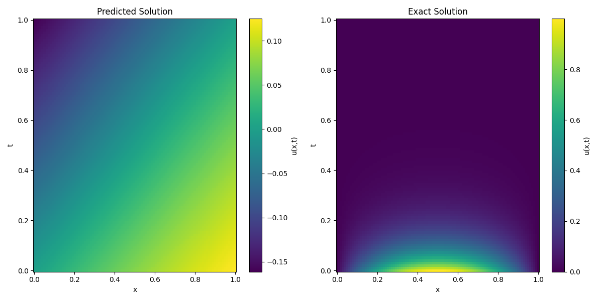
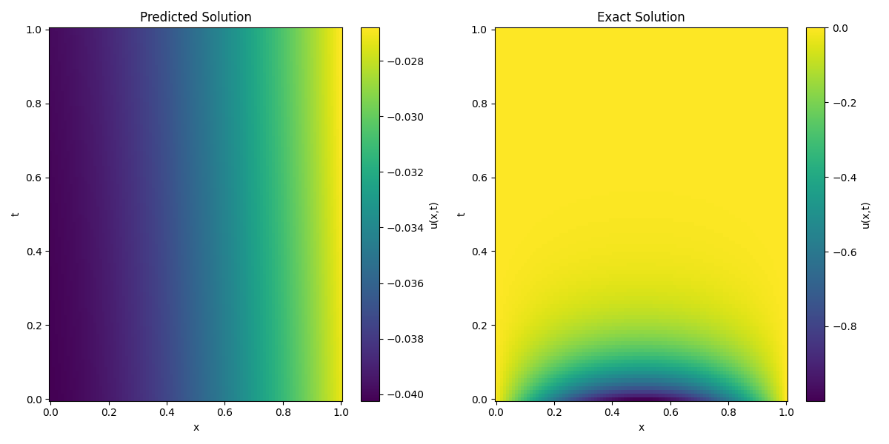
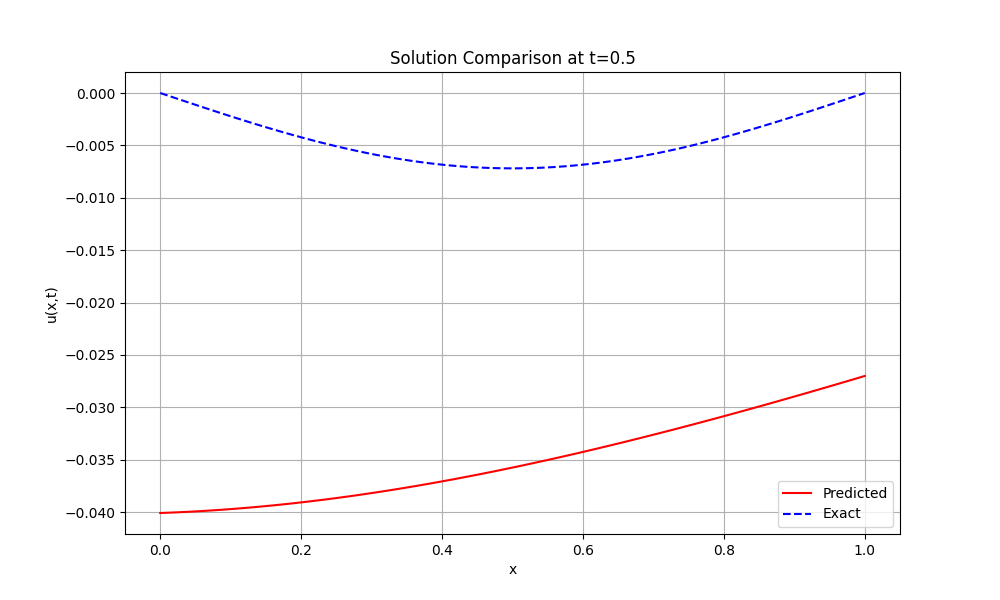

# About
A Physics-Informed Neural Network (PINN) framework for solving partial differential equations (PDEs) with FastAPI integration. This project implements PINNs for various physical systems including simple harmonic motion, heat transfer, wave propagation, and fluid dynamics (Burgers' equation). The framework provides a modular architecture for training neural networks that respect physical laws, with RESTful APIs for model training and prediction.

# Physics-Informed Neural Network (PINN) Project

This project implements a modular framework for solving partial differential equations (PDEs) using Physics-Informed Neural Networks (PINNs). It supports multiple equations (e.g., simple harmonic motion, heat, wave, Burgers' equations) and includes a FastAPI server for exposing PINN functionality via RESTful APIs. The framework is designed for extensibility, with separate modules for models, equations, data generation, training, evaluation, and hyperparameter tuning.

## Framework Overview

The framework consists of several key components:
1. **Models**: Neural network architectures for different equations
2. **Equations**: Mathematical formulations of physical laws
3. **Data Generation**: Tools for creating training and validation data
4. **Training**: Algorithms for optimizing the neural networks
5. **API**: RESTful interface for model training and prediction
6. **Results**: Storage and visualization of model outputs

## Mathematical Background

### Simple Harmonic Motion
The simple harmonic motion equation describes the motion of a mass on a spring:
```
d²x/dt² + ω²x = 0
```
where:
- x(t) is the displacement at time t
- ω is the angular frequency
- d²x/dt² is the second time derivative

### Heat Equation
The heat equation describes the distribution of heat in a given region over time:
```
∂u/∂t = α ∂²u/∂x²
```
where:
- u(x,t) is the temperature at position x and time t
- α is the thermal diffusivity
- ∂u/∂t is the time derivative
- ∂²u/∂x² is the second spatial derivative

### Wave Equation
The wave equation describes the propagation of waves:
```
∂²u/∂t² = c² ∂²u/∂x²
```
where:
- u(x,t) is the wave amplitude at position x and time t
- c is the wave speed
- ∂²u/∂t² is the second time derivative
- ∂²u/∂x² is the second spatial derivative

### Burgers' Equation
Burgers' equation describes the evolution of a viscous fluid:
```
∂u/∂t + u ∂u/∂x = ν ∂²u/∂x²
```
where:
- u(x,t) is the fluid velocity at position x and time t
- ν is the viscosity coefficient
- ∂u/∂t is the time derivative
- u ∂u/∂x is the nonlinear advection term
- ν ∂²u/∂x² is the diffusion term

## Features
- **Modular PINN Implementation**: Supports multiple equations with reusable base classes.
- **FastAPI Integration**: RESTful API for training and predicting with PINN models.
- **Hyperparameter Tuning**: Scripts for optimizing model parameters using Optuna.
- **Extensible Structure**: Easily add new equations by extending existing modules.
- **Comprehensive Testing**: Unit tests for all major components.
- **Data Generation**: Flexible data generation for training and validation.
- **Visualization Tools**: Tools for plotting and analyzing results.
- **Configuration Management**: YAML-based configuration for easy parameter tuning.
- **Structured Logging**: Comprehensive logging system for API interactions and training progress.

## Logging System
The framework includes a robust logging system that tracks:
- **API Interactions**: Request/response details, status codes, and error tracking
- **Training Progress**: Training start/end, per-epoch metrics, and model saving events
- **Error Handling**: Detailed error logging with stack traces
- **Performance Metrics**: Training time and model performance statistics

Log files are stored in the `logs` directory:
- `logs/api.log`: API request/response logging
- `logs/training.log`: Training progress and metrics

Log rotation is configured with:
- Maximum file size: 10MB
- Backup files: 5
- Automatic rotation

## Project Structure 
The project structure is as follows:
```
physics_informed_neural_network/
├── app/
│   ├── __init__.py
│   ├── api/
│   │   ├── __init__.py
│   │   ├── endpoints/
│   │   │   ├── __init__.py
│   │   │   ├── shm.py
│   │   │   ├── heat.py
│   │   │   ├── wave.py
│   │   │   └── burgers.py
│   │   └── router.py
│   ├── core/
│   │   ├── __init__.py
│   │   ├── config.py
│   │   └── dependencies.py
│   └── schemas/
│       ├── __init__.py
│       ├── shm.py
│       ├── heat.py
│       ├── wave.py
│       └── burgers.py
├── logs/
│   ├── api.log
│   └── training.log
├── src/
│   ├── models/
│   │   ├── base_pinn.py
│   │   ├── shm_pinn.py
│   │   ├── heat_pinn.py
│   │   ├── wave_pinn.py
│   │   └── burgers_pinn.py
│   ├── equations/
│   │   ├── base_equation.py
│   │   ├── shm_equation.py
│   │   ├── heat_equation.py
│   │   ├── wave_equation.py
│   │   └── burgers_equation.py
│   ├── data/
│   │   ├── generators/
│   │   │   ├── data_generator.py
│   │   │   ├── shm_data.py
│   │   │   ├── heat_data.py
│   │   │   ├── wave_data.py
│   │   │   └── burgers_data.py
│   │   ├── initial_conditions/
│   │   │   ├── ic_shm.py
│   │   │   ├── ic_heat.py
│   │   │   ├── ic_wave.py
│   │   │   └── ic_burgers.py
│   │   └── boundary_conditions/
│   │       ├── bc_heat.py
│   │       ├── bc_wave.py
│   │       └── bc_burgers.py
│   ├── training/
│   │   ├── trainer.py
│   │   ├── shm_trainer.py
│   │   ├── heat_trainer.py
│   │   ├── wave_trainer.py
│   │   └── burgers_trainer.py
│   └── utils/
│       ├── __init__.py
│       └── config_parser.py
├── results/
│   ├── shm/
│   │   ├── models/
│   │   │   └── model.pth
│   │   ├── plots/
│   │   │   ├── loss_curve.png
│   │   │   ├── solution_comparison.png
│   │   │   └── solution_slice.png
│   │   └── metrics/
│   │       └── loss_history.npy
│   ├── heat/
│   │   ├── models/
│   │   │   └── model.pth
│   │   ├── plots/
│   │   │   ├── loss_curve.png
│   │   │   ├── solution_comparison.png
│   │   │   └── solution_slice.png
│   │   └── metrics/
│   │       └── loss_history.npy
│   ├── wave/
│   │   ├── models/
│   │   │   └── model.pth
│   │   ├── plots/
│   │   │   ├── loss_curve.png
│   │   │   ├── solution_comparison.png
│   │   │   └── solution_slice.png
│   │   └── metrics/
│   │       └── loss_history.npy
│   └── burgers/
│       ├── models/
│       │   └── model.pth
│       ├── plots/
│       │   ├── loss_curve.png
│       │   ├── solution_comparison.png
│       │   └── solution_slice.png
│       └── metrics/
│           └── loss_history.npy
├── configs/
│   └── equations/
│       ├── shm_equation.yaml
│       ├── heat_equation.yaml
│       ├── wave_equation.yaml
│       └── burgers_equation.yaml
├── scripts/
│   ├── hyperparameter_tuning/
│   │   ├── tune_shm.py
│   │   ├── tune_heat.py
│   │   ├── tune_wave.py
│   │   └── tune_burgers.py
│   └── analyze_results.py
├── tests/
│   ├── __init__.py
│   ├── test_models.py
│   ├── test_equations.py
│   ├── test_data.py
│   └── test_training.py
├── requirements.txt
├── setup_project.sh
├── activate_ml_env.sh
├── activate_ml_env.ps1
└── README.md
```

## Results Directory Structure
The results directory (`results/`) contains subdirectories for each equation type (shm, heat, wave, burgers). Each equation directory has the following structure:
```
results/<equation>/
├── models/
│   └── model.pth           # Trained model weights
├── plots/
│   ├── loss_curve.png      # Training loss curve
│   ├── solution_comparison.png  # Comparison of predicted and exact solutions
│   └── solution_slice.png  # Solution slice at a fixed time
└── metrics/
    └── loss_history.npy    # Training loss history
```

## API Usage
The FastAPI server provides endpoints for training and prediction for each equation type. The API documentation is available at `http://localhost:8000/docs` when the server is running.


The Swagger UI provides an interactive interface to:
1. View all available endpoints
2. Test the API directly from the browser
3. See request/response schemas
4. View example requests

### Training Endpoints
- `POST /shm/train`
- `POST /heat/train`
- `POST /wave/train`
- `POST /burgers/train`

Each training endpoint accepts a JSON body with:
```json
{
    "epochs": 1000,
    "learning_rate": 0.001
}
```

### Prediction Endpoints
- `POST /shm/predict`
- `POST /heat/predict`
- `POST /wave/predict`
- `POST /burgers/predict`

Each prediction endpoint accepts a JSON body with:
```json
{
    "x": [0.1, 0.2, 0.3],  // Spatial coordinates (not used for SHM)
    "t": [0.1, 0.2, 0.3]   // Temporal coordinates
}
```

## Results Showcase

### Simple Harmonic Motion

*Comparison of PINN prediction (blue) vs exact solution (red) for Simple Harmonic Motion*

### Heat Equation

*Temperature distribution predicted by the PINN (left) vs exact solution (right)*

### Wave Equation

*Wave propagation predicted by the PINN (left) vs exact solution (right)*

### Burgers' Equation

*Velocity field predicted by the PINN (left) vs exact solution (right)*

### Training Progress
Example loss curves showing the convergence of the PINN training:

*Training loss over epochs for the Heat Equation*

### Solution Slices
Temporal evolution of solutions at specific points:

*Solution evolution over time for Burgers' Equation*

## Getting Started
1. Clone the repository
2. Create and activate the virtual environment:
   ```bash
   # On Windows
   .\activate_ml_env.ps1
   
   # On Linux/Mac
   source activate_ml_env.sh
   ```
3. Install dependencies:
   ```bash
   pip install -r requirements.txt
   ```
4. Run the FastAPI server:
   ```bash
   python main.py
   ```
5. Access the API documentation at `http://localhost:8000/docs`

## Local Testing of GitHub Actions
You can test the GitHub Actions workflows locally using `act`. This helps catch issues before pushing to the repository.

### Windows Setup
1. Install [Docker Desktop for Windows](https://www.docker.com/products/docker-desktop/)
2. Run the setup script as Administrator:
   ```powershell
   # Open PowerShell as Administrator and run:
   .\scripts\setup_windows_env.ps1
   ```
   This will:
   - Install Scoop package manager
   - Install act
   - Verify Docker installation

3. Start Docker Desktop and wait for it to be running

### Running Local Tests
```powershell
# Open PowerShell as Administrator and run:
.\scripts\test_workflows.ps1
```

The script will:
1. Verify all prerequisites are met
2. Run the CI workflow tests
3. Run the CD workflow tests in dry-run mode

Note: The CD workflow requires Heroku credentials. For local testing, it runs in dry-run mode by default.

### Troubleshooting
If you encounter issues:
1. Make sure Docker Desktop is running
2. Run PowerShell as Administrator
3. Check if all prerequisites are installed:
   ```powershell
   # Check Docker
   docker --version
   
   # Check act
   act --version
   ```

## Contributing
Contributions are welcome! Please feel free to submit a Pull Request.

## License
This project is licensed under the MIT License - see the LICENSE file for details.